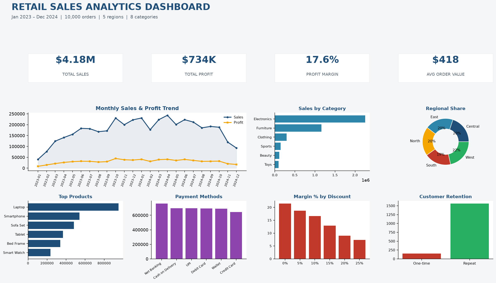

# 🛒 Retail Sales Analytics — End-to-End Data Analytics Project

An end-to-end retail analytics case study built with **SQL (MySQL), Excel, Power BI and Python**, covering 10,000 transactions across 24 months, 1,714 customers, 40 products and 5 regions.



---

## 📌 Project Overview
| | |
|---|---|
| **Records** | 10,000 orders |
| **Period** | Jan 2023 – Dec 2024 |
| **Customers** | 1,714 |
| **Products / Categories** | 40 / 8 |
| **Regions / Cities** | 5 / 20 |
| **Tools** | MySQL 8 · Excel · Power BI · Python (Pandas, Matplotlib) |

## 📊 Key Results
| KPI | Value |
|---|---|
| Total Sales | **$4,178,681** |
| Total Profit | **$733,594** |
| Profit Margin | **17.6%** |
| Average Order Value | **$417.87** |
| YoY Growth (2023 → 2024) | **+20.8%** |
| Repeat Customer Rate | **91.2%** |
| Top Category | Electronics (53.9% of sales) |

---

## 🗂 Repository Structure
```
Retail-Sales-Analytics/
├── Data/
│   ├── retail_sales_data.csv              # Master dataset (10,000 records)
│   ├── retail_sales_raw_uncleaned.csv     # Dirty extract for the Excel exercise
│   └── retail_sales_cleaned.csv           # Output of the Excel cleaning process
├── SQL/
│   ├── 01_create_database.sql             # Database, tables, indexes, join view
│   ├── 02_insert_data.sql                 # Batched INSERTs for all records
│   ├── 03_analysis_queries.sql            # 10 business queries (CTEs, windows, cohorts, RFM)
│   └── 04_kpi_views.sql                   # Reusable views for Power BI
├── Excel/
│   ├── Retail_Sales_Cleaning_Analysis.xlsx  # Cleaning log, clean data, KPI sheet, 4 pivot charts
│   └── Excel_Cleaning_Steps.md            # Step-by-step cleaning methodology
├── PowerBI/
│   ├── PowerBI_Build_Guide.md             # Model, 4-page report spec, slicers, maps
│   ├── DAX_Measures.txt                   # 25+ measures incl. time intelligence & retention
│   └── Theme.json                         # Corporate colour theme
├── Python/
│   ├── eda_retail_sales.py                # Full EDA pipeline → charts + summary CSVs
│   ├── load_to_mysql.py                   # CSV → MySQL loader
│   └── requirements.txt
├── Dashboard/
│   ├── dashboard_mockup.png               # Dashboard preview
│   └── charts/                            # 8 analysis charts (PNG)
└── Documentation/
    ├── Business_Insights_and_Recommendations.md
    ├── Project_Report.md
    ├── Data_Dictionary.md
    └── *.csv                              # Exported summary tables
```

---

## 🚀 Quick Start

### 1. SQL (MySQL 8+)
```bash
mysql -u root -p < SQL/01_create_database.sql
mysql -u root -p < SQL/02_insert_data.sql
mysql -u root -p retail_analytics < SQL/04_kpi_views.sql
# then run any query from SQL/03_analysis_queries.sql
```

### 2. Python
```bash
pip install -r Python/requirements.txt
python Python/eda_retail_sales.py          # writes charts + summary CSVs
python Python/load_to_mysql.py             # optional: load CSV straight into MySQL
```

### 3. Excel
Open `Excel/Retail_Sales_Cleaning_Analysis.xlsx` — the KPI sheet is fully formula-driven and recalculates on open.

### 4. Power BI
Follow `PowerBI/PowerBI_Build_Guide.md`, paste the measures from `DAX_Measures.txt`, apply `Theme.json`.

---

## 🔍 Analyses Included
- Total sales, total profit and margin
- Monthly sales trend with MoM / YoY comparison
- Top 10 products and top 10 customers
- Regional sales and margin analysis
- Category-wise performance
- Average order value (overall, monthly, regional)
- Highest profit products
- Customer retention: repeat rate, cohort matrix, RFM segmentation
- Discount vs margin elasticity
- Payment method and demographic breakdowns

## 💡 Headline Insights
1. **+20.8% YoY growth** — 2024 ($2.29M) clearly outpaced 2023 ($1.89M).
2. **Electronics + Furniture = 82% of revenue** — the long tail contributes under 5%.
3. **Discounts destroy margin**: 21.5% margin at 0% discount vs **7.4% at 25%**.
4. **Five SKUs drive 64% of sales** and are also the most profitable.
5. **91.2% repeat rate but only 3.8% of revenue from the top 10 customers** — broad, shallow base ready for a loyalty tier.

Full analysis with recommendations: [`Documentation/Business_Insights_and_Recommendations.md`](Documentation/Business_Insights_and_Recommendations.md)

## Streamlit App (no Power BI needed)
An interactive dashboard with the same KPIs, filters and charts, runnable locally:

```bash
cd Streamlit
pip install -r requirements.txt
streamlit run app.py
```

Sidebar filters (date range, region, city, category, product, payment method, salesperson, gender, age band) drive KPI cards with prior-period deltas, the monthly trend, category/region mix, top-10 product & customer rankings, discount-vs-margin analysis, the salesperson leaderboard, and a downloadable filtered table. See [`Streamlit/README.md`](Streamlit/README.md).

## 🛠 Skills Demonstrated
Data modelling · SQL window functions & CTEs · cohort and RFM analysis · Excel data cleaning and dashboarding · Pandas pipelines · Matplotlib visual design · DAX time intelligence · business storytelling.

## 📄 License
MIT — the dataset is synthetic and free to reuse for learning and portfolio work.
